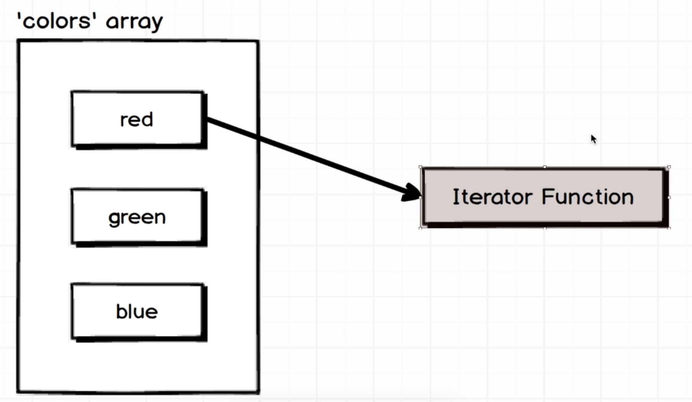
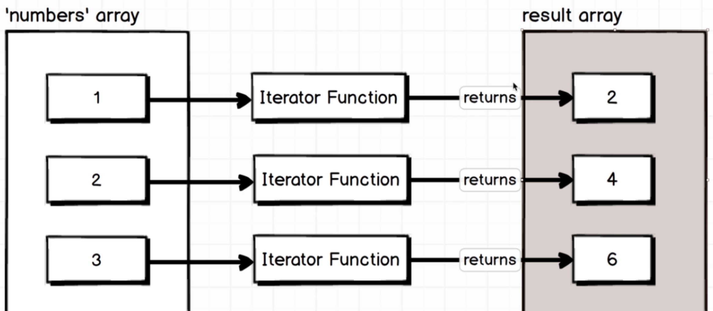
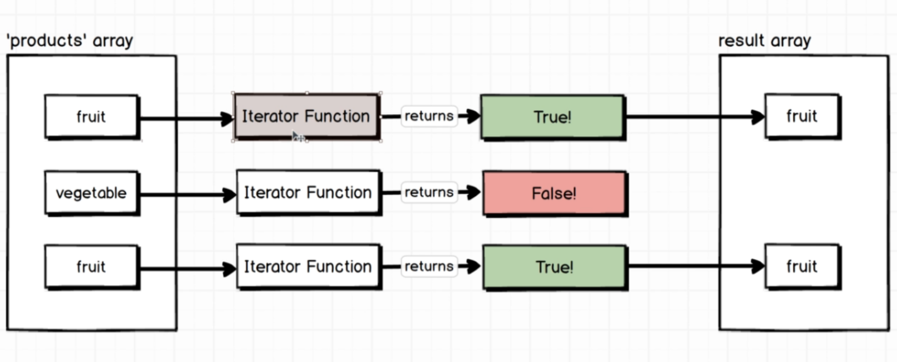
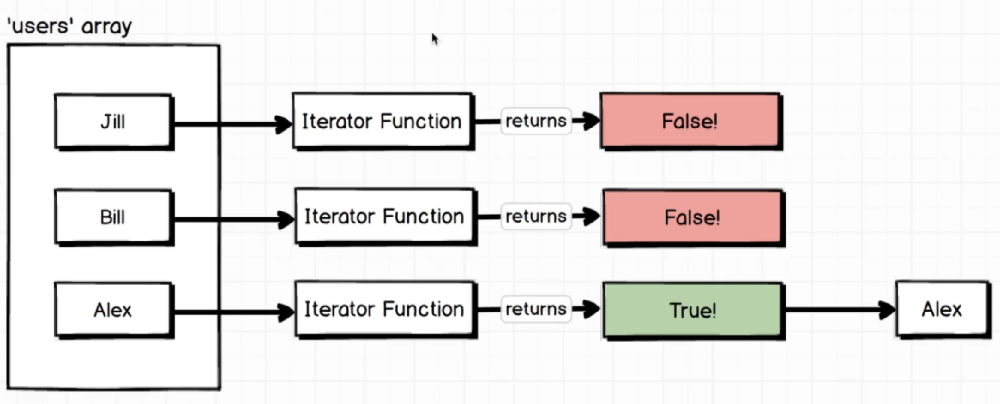
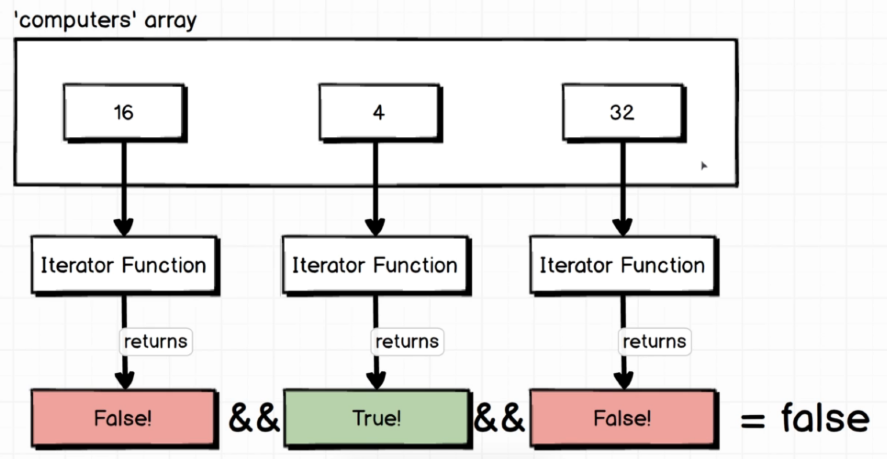
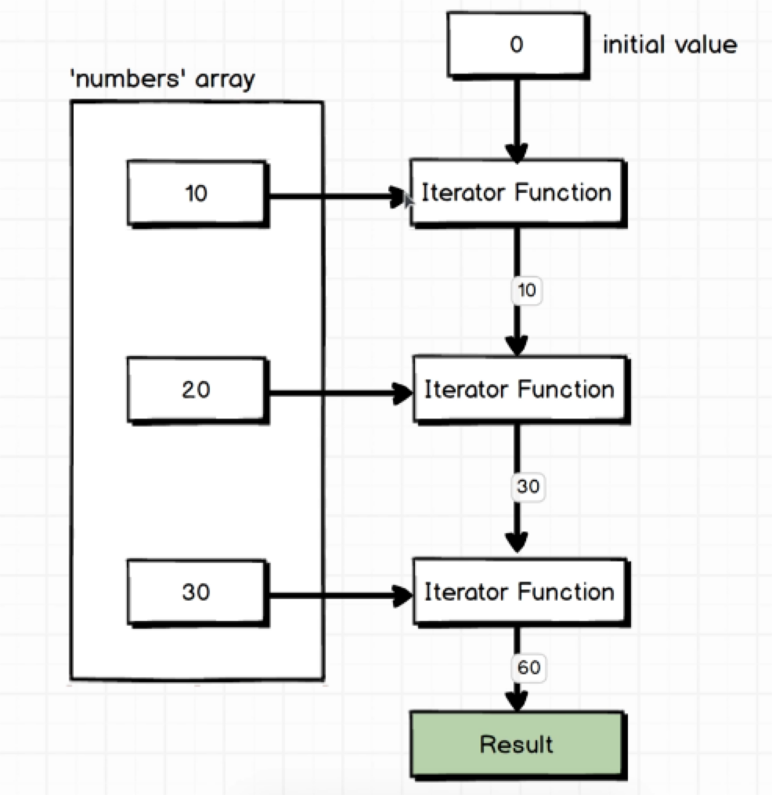

= ECMAScript6

:toc: left
:toclevels: 5
:sectnums:

== ES6 Javascript: The Complete Developer's Guide

NOTE: forEach. Iterate each element in the list.

----
var posts = ['a','b','c'];

//There is iterator involved here.
posts.forEach(function(post){
    console.log(post)
});
----

---

NOTE: map. Iternate each element in the list. Perform some operation and create new list.

----
var numbers = [1,2,3];

// There is an iterator involved here.
// This code uses the map() function in JavaScript to create a new array
var doubled = numbers.map(function(number){
    console.log('I came here...');
    return number * 2;
}
);

console.log(doubled)
----

---

NOTE: filter. Return ALL that is true.

----
var users = [
  { id: 1, admin: true },
  { id: 2, admin: false },
  { id: 3, admin: false },
  { id: 4, admin: false },
  { id: 5, admin: true },
];

var filteredUsers = users.filter(function (user) {
  return user.admin;
});

console.log(filteredUsers);
----

---

NOTE: find. Return 1st matching

---

----
// Sample array of objects
const users = [
  { id: 1, name: 'Alice' },
  { id: 3, name: 'Charlie' },
  { id: 3, name: 'Bob' },
  { id: 4, name: 'David' }
];

// Using find to get the first user with id equal to 3
const foundUser = users.find(function(user){
  return user.id === 3;
});

console.log(foundUser); // Output: { id: 3, name: 'Charlie' }

----

---

NOTE: every / some

---

NOTE: reduce - so the initial value was that second argument that I passed  to reduce.

